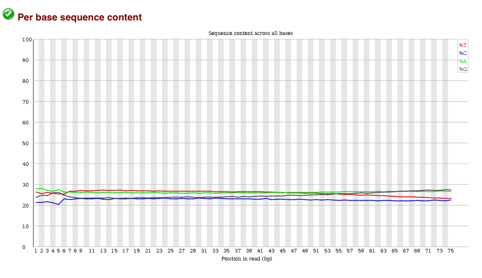
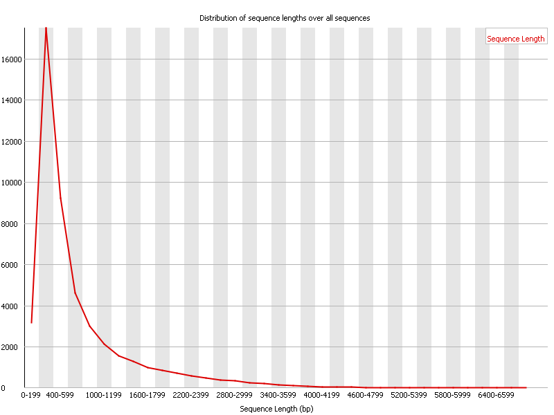
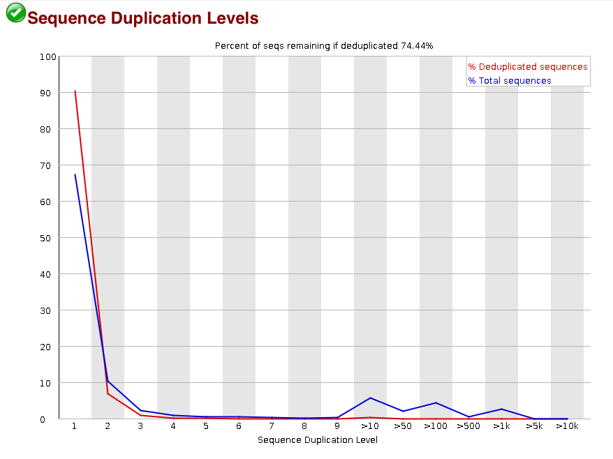
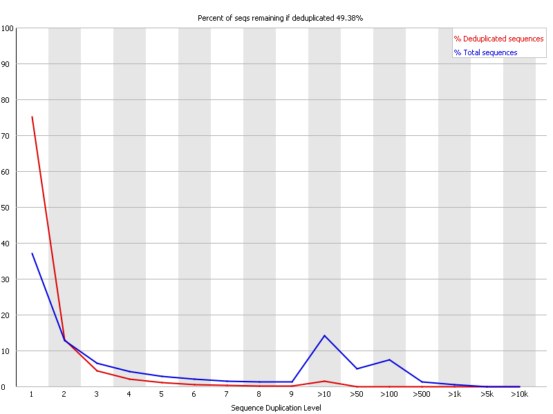
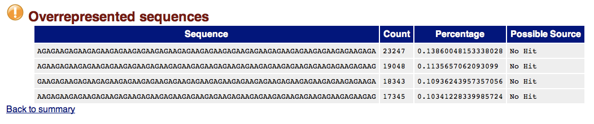
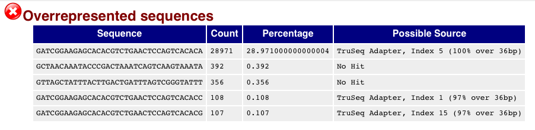

# Overview

- [Seqeunces in Bioconductor](#bioc)
- [Fastqc Primer](#fastqc)
- [Alignment](#alignment)
- [Appendix](#appendix)

## Illumina sequencing overview*

This video gives and overview of the  *'sequencing-by-synthesis'* approach used by Illumina. Other companies will have different techniques, but Illumina is probably the most-popular sequencing technology out there. For most of what we will discuss, it won't really matter how your samples were sequenced. 

<iframe width="420" height="315" src="https://www.youtube.com/embed/HMyCqWhwB8E" frameborder="0" allowfullscreen></iframe>

http://www.illumina.com/content/dam/illumina-marketing/documents/products/illumina_sequencing_introduction.pdf

\* Other sequencing technologies are available

## Illumina sequencing
http://www.illumina.com/content/dam/illumina-marketing/documents/products/illumina_sequencing_introduction.pdf


## Paired-end


## Multiplexing


## Image processing 

- Sequencing produces high-resolution TIFF images; not unlike microarray data
- 100 tiles per lane, 8 lanes per flow cell, 100 cycles
- 4 images (A,G,C,T) per tile per cycle = 320,000 images
- Each *TIFF* image ~ 7Mb = 2,240,000 Mb of data (**2.24TB**)


## Image processing

- Firecrest


- *"Uses the raw TIF files to locate clusters on the image, and outputs the cluster intensity, X,Y positions, and an estimate of the noise for each cluster. The output from image analysis provides the input for base calling."*

    + http://openwetware.org/wiki/BioMicroCenter:IlluminaDataPipeline
- **You will never have to do this**
    + In fact, the TIFF images are deleted by the instrument
    
## Base-calling

- Bustard


- *"Uses cluster intensities and noise estimate to output the sequence of bases read from each cluster, along with a confidence level for each base."*
    + http://openwetware.org/wiki/BioMicroCenter:IlluminaDataPipeline
- **You will never have to do this**


## <a name=rawreads></a> Raw reads

- The most basic file type you will see is probably going to be *fastq*
    + Data in public-repositories (e.g. Short Read Archive, GEO) tend to be in this format
- This represents all sequences created after imaging process
    + No idea at this stage whether the sequences will align or not
- No standard file extension. *.fq*, *.fastq*, *.sequence.txt*
- Essentially they are text files
    + Can be manipulated with standard unix tools; e.g. *cat*, *head*, *grep*, *more*, *less*
- They can be compressed and appear as *.fq.gz*
- Same format regardless of sequencing protocol (i.e. RNA-seq, ChIP-seq, DNA-seq etc)
- Each sequence is described over 4 lines

```
@SEQ_ID
GATTTGGGGTTCAAAGCAGTATCGATCAAATAGTAAATCCATTTGTTCAACTCACAGTTT
+
!''*((((***+))%%%++)(%%%%).1***-+*''))**55CCF>>>>>>CCCCCCC65
```
We don't need any special software to view these, but bear in mind there can be ~ 250 Million reads (sequences) per Hi-Seq lane. Opening in Word would not be advisable.

### Fastq sequence names

The name of a sequence is unique and can encode some useful information

```
@HWUSI-EAS100R:6:73:941:1973#0/1
```

- The name of the sequencer (HWUSI-EAS100R)
- The flow cell lane (6)
- Tile number with the lane (73)
- x co-ordinate within the tile (941)
- y co-ordinate within the tile (1973)
- \#0 index number for a multiplexed sample 
-  /1; the member of a pair, /1 or /2 (paired-end or mate-pair reads only)

### Fastq quality scores

The quality score expresses our confidence in a particular base-call. 

- One such score for each base of sequencing. i.e. 100 scores for 100 bases of sequencing
- These are of importance if we want to call SNVs etc.
    + need to be sure that differences detected from the reference genome and legitimate, and not caused by sequencing error

The raw base-calling probabilities are converted to text characters to make it easier to store in a file

```
!''*((((***+))%%%++)(%%%%).1***-+*''))**55CCF>>>>>>CCCCCCC65
```

First of all, we convert the base-calling probability into a `Q` score using the formula

- Quality scores $$ Q = -10log_{10}p$$
    + Q = 30, p=0.001
    + Q = 20, p=0.01
    + Q = 10, p=0.1
- These numeric quanties are *encoded* as [**ASCII**](http://ascii-code.com/) code
    + ASCII codes 1 - 32 have historical uses such as start of text, carriage return, new line etc
    + At least 33 to get to meaningful characters
    + An offset needs to be used before encoding

Annoyingly, different sequencing instruments have used different offsets over time. It's important to check what encoding has been used for your data

- Most modern sequencing will be `Phred+33`
- Tools should be able to detect what is in-use


# Hands-on Practice

## Command line

Two example fastq files have been provided for you. Use the following commands to print the first few lines of the files to the screen.

You will need to open a ***Terminal*** to do this and *change directory* to `/home/participant/Course_Materials/Day1/`


******
### Exercise
- How many reads are printed?
- What is the relationship between `sample.fq1` and `sample.fq2`. What part of the file tells us this?
- How many lines are there in the file(s)?
    + the Unix command `wc -l` can tell us the number of lines in a plain text file
- How many reads does this equate to?

```{}
cd /home/participant/Course_Materials/Day1/
```


```{}
head -n 12 sample.fq1
```

```{r, echo=FALSE,comment=NA}
cat(system("head -n12 sample.fq1",intern=TRUE),sep="\n")
```

```{}
head -n 12 sample.fq2
```


```{r, echo=FALSE,comment=NA}
cat(system("head -n12 sample.fq2",intern=TRUE),sep="\n")
```

```{}
wc -l sample1.fq1
```

```{r echo=FALSE,comment=NA}
cat(system("wc -l sample.fq1",intern=TRUE),sep="\n")
```

******

## <a name="bioc"></a> Bioconductor

For the next part of the session, we will be using RStudio


We will now use the `ShortRead` Bioconductor package to understand these files a bit more. Please note that we are using this package for exploration and to demonstrate what the data look like. We probably wouldn't want to perform these tasks in a production-level analysis, and there are far superior tools for visualising fastq files (as we will see later).

If you are curious how these fastq files were generated, you can see the [Appendix](#appendix) for details.

```{r echo=FALSE,message=FALSE}
library(ShortRead)
```

******
### Exercise

Import the example `fastq` file using the `ShortRead` package.

- How many reads are found?
- How long is each sequenced read?

```{r message=FALSE, results='hide'}
library(ShortRead)
fq <- readFastq("sample.fq1")
fq
```

******

The object we have just created is typical of how data are presented in Bioconductor packages; typing the name of the object `fq` prints a summary of the contents to the screen, and we have to use a series of functions to extract the contents. Such functions are referred to as *accessor functions*. 

One such function is called `sread` and allows us to access the sequencing reads. Conveniently, using the function prints a summary to the screen so that only the first five and last five reads in the file are displayed. The type of this object is a `DNAStringSet`, which is a very efficient way of storing DNA sequences in Bioconductor. The `Biostrings` package has lots of useful tools to manipulate these objects. We can save the result of `sread` to a variable for futher processing.


```{r}
sread(fq)
myreads <- sread(fq)
```

Even though the data they represent are much more complex, the way in which we subset the data should be familiar to us. This means there are no new rules to learn when it comes to accessing the data.

Try the following:-

```{r}
myreads[1:5]
```

We can treat the `myreads` object as a vector and use the `[]` in the normal fashion. However, it might be tempting to think that two indexes could be used to subset both the read index ,and the position in the read.

```{r eval=FALSE}
myreads[1:5,1:10]
```

Alas, the object is not designed to work in this way and we get an error message.

```{r echo=FALSE}
t <- try(myreads[1:5,1:3],silent=TRUE)
cat(t)
```

If we want to chop-up the strings in this manner, we can use the `subseq` function. 

******

### Exercise

- What type of object is returned by the `subseq` function
    + Remember, you can get help on this function by typing `?subseq` in the R console
- Print the first five basees of the first 10 sequence reads
- How many reads start with five A's?
    + HINT: we can test for equality using `==` which gives a logical (`TRUE` or `FALSE`)

```{r echo=FALSE}
firstBases <- subseq(myreads,1,5)
```

******


As we mentioned, `Biostrings` contains many useful functions for dealing with DNA sequences. Many man-hours have been spent trying to re-implement functions that are already provided in this package; often with less-efficient results! You can consult the help page for `Biostrings` (which can be found via the Packages tab in the bottom-right panel of RStudio) for a full list. 


The *"base"* distribution of R offers many string manipulation functions. One is `substr` that will perform the trimming of characters in the same manner. However, `substr` is a lot slower as it has not been optimised for large datasets of biological sequences. 

Moral: always check if there is a function in `Biostrings` that you can use rather than a base function.
```{r}
system.time(subseq(myreads, 1,5))
system.time(substr(myreads, 1,5))
```


Another useful function is `letterFrequency`, which seeks to tabulate the number of letters in each sequence in the form of a matrix. The `N` here represents positions were a call could not be made

```{r}
af <- letterFrequency(sread(fq), letters=c("A","C","G","T","N"))
head(af)
```

This matrix can be accessed in the usual manner. For instance, we could get the number of `A` bases for each read, as a vector, and produce a histogram with the following two lines:-

```{r}
aS <- af[,1]
hist(aS)
```

******

### Exercise

- Which read has the greatest number of N bases?
- Create a vector to represent the "GC" content of each read
- What is the mean number of GC bases?
- Visualise the GC distribution using a histogram
- What reads have more than 60 GC bases?

The following R output is for your reference

```{r echo=FALSE}
myreads[which.max(af[,5])]
gc <- af[,"C"] + af[,"G"]
hist(gc)
myreads[gc > 60]
badGCReads <- which(gc > 60)
``` 

******

Note that at this point we have not performed any manipulation on the reads themselves. If we wanted to make persistent changes to the object, such as creating a subset, we would have to overwrite the `myreads` object (not recommended!) or create a new object

```{r}
myreads
```


We can remove reads using the negative index approach

```{r eval=FALSE}
goodReads <- myreads[-badGCReads]
```


Recall that we have other information in the file as well as the sequences. For instance, the IDs of the reads can be accessed in a similar fashion. Crucially they are in the same order as the sequencing reads in the `myreads`, so any logical vectors derived from the sequencing reads can be used to subset the IDs; and vice-versa. So if we wanted to know the identities of reads with most N bases, we could do:-

```{r}
myids <- id(fq)
myids
myids[which(af[,5]>4)]
```

We can look in more detail at the number of bases that were called during each round of sequencing

```{r}
abc <- alphabetByCycle(myreads,alphabet = c("A","C","G","T","N"))
head(abc)[,1:5]
```

We can visualise the number of N bases, and how they increase as sequencing progresses
```{r}
plot(1:68, abc[5,1:68],type="n")
text(1:68, abc[5,1:68], label="N")
```

******

### Exercise


Can you make the following plot to illustrate the number of each DNA base observed at each position?

```{r echo=FALSE}
plot(abc[1,],type="n",ylim=c(0,2000000))
text(abc[1,1:68],label="A",col="red")
text(abc[2,1:68],label="C",col="orange")
text(abc[3,1:68],label="G",col="blue")
text(abc[4,1:68],label="T",col="green")
```

******


The final piece of information in the fastq file is the *quality* associated with each base call. This is especially important when it comes to calling SNVs, as we need to be sure of the bases we observe. The `quality` function is used to access these data.

```{r}
quality(fq)
myquals <- quality(fq)
```

We noted before, a variey of different schemes can be used to encode the qualities. Fortunately, with the help of the `encoding` function, we can make a guess about what scale is being used in our file

```{r}
encoding(quality(fq))
```

******

### Exercise

- What can you say about the quality of base calls in the first five reads?
- What reads seem to have lower quality? 
    + Is it a particular part of the read that is low quality? 
    + Or the whole read?

******

Quality scores can often be used to motivate the need for trimming, or to use an aligner that can incorporate quality information. We can use the following two commands to obtain a more-familiar matrix of numeric values to represent quality

```{r}
qm <- as(quality(fq), "matrix")
head(qm)
```


To look at global trends, it is useful to look at the mean quality at each base. The `colMeans` function in R provides a quick way of being able to compute the average (mean) of each column in a *matrix*. 

```{r}
qualmeans <- colMeans(qm)
plot(qualmeans)
```


Hopefully this section was useful in familiarising yourself with the contents of a `fastq` file and give ideas about how R and Bioconductor can interface with sequencing data. However, in practice we would not normally look into fastq files in such depth in R. 

# <a name="fastqc"></a> Fastqc Primer and trimming reads
*(Acknowledgement to Ines De Santiago for her session at the [previous summer school](http://bioinformatics-core-shared-training.github.io/cruk-bioinf-sschool/Day1/NGS_QC_inesdesantiago.pdf))*

[FastQC](http://www.bioinformatics.babraham.ac.uk/projects/fastqc/) from Babraham Bioinformatics Core has emerged as the standard tool for performing quality assessment on sequencing reads 

It can be run from the ***Terminal*** as follows;

```{}
fastqc sample.fq1
```

As a result, you should get two files in your working directory; `sample.fq1_fastqc.zip` and `sample.fq1_fastqc.html`. The `.zip` file contains all the metrics that `fastqc` computes, should you wish to perform extra manipulation and visualisation beyond what `fastqc` offers. The `html` file can be opened in a web browser. The easier way to see the output is to navigate to the current directory using a file explorer, and double-click on the file.

The manual for `fastqc` is available [online](http://www.bioinformatics.babraham.ac.uk/projects/fastqc/Help/) and is very comprehensive; especially the parts which describe particular [sections](http://www.bioinformatics.babraham.ac.uk/projects/fastqc/Help/3%20Analysis%20Modules/) of the report. The authors also run a ["QCfail"](https://sequencing.qcfail.com/) blog which discusses some sequencing QC errors they have encountered and how they were diagnosed.

A *"traffic light"* system is used to draw your attention to sections of the report that require further investigation. However, it is worth bearing in mind that `fastqc` is designed to be run on fastq files from any type of sequencing experiment and has no knowledge of the particular library preparation, or conditions that you are studying. It could be that you *expect* high levels of duplication or GC content. Always consider the nature of your study before taking any drastic action!

## The sections of a `fastqc` report

1) [Basic Statistics](http://www.bioinformatics.babraham.ac.uk/projects/fastqc/Help/3%20Analysis%20Modules/1%20Basic%20Statistics.html)


Some simple statistics about the composition of your file, which can be useful to see if it has guessed the encoding correctly and identified the correct number of reads. This section of the report is designed ***never*** to give a warning message

2) [Per-base sequence quality](http://www.bioinformatics.babraham.ac.uk/projects/fastqc/Help/3%20Analysis%20Modules/2%20Per%20Base%20Sequence%20Quality.html)


This section of the report is probably the one that receives most attention. It's generally accepted that there is a degradation of quality over the duration of a sequencing run, but the extent to which the quality "drops-off" should be monitored. A boxplot is produced for every base-position in the read and the central line and yellow box represent the median and inter-quartile range in the usual manner.

Ideally, the plot should look *something* like following:-


However, a ***warning*** will be triggered if the lower quartile (25% of the data) of any base in less than 10, or if the median for any base is less than 25. A ***failure*** (red cross in the traffic light system) occurs if the lower quartile for any base is less than 5, or if the median for any base is less than 20.

3) [Per-sequence quality scores](http://www.bioinformatics.babraham.ac.uk/projects/fastqc/Help/3%20Analysis%20Modules/3%20Per%20Sequence%20Quality%20Scores.html)

With this section of the report, we are checking to see if there is a population of sequences that have low quality values. A ***warning*** occurs when the mean quality is below 27, whereas a ***failure*** indicates a mean below 20.


4) [Per-base sequence content](http://www.bioinformatics.babraham.ac.uk/projects/fastqc/Help/3%20Analysis%20Modules/4%20Per%20Base%20Sequence%20Content.html)

This is one area of the report where you need to exercise some caution, because the results may depend on the type of sequencing you are performing. This course is going to be focussed on whole-genome (or exome) DNA sequencing, which should result in an even distribution of bases along the read length.



Sometimes you will get biased sequencing composition at the start of reads due to adaptor contamination, which would tend to be flagged elsewhere in the report


And some biases are inevitable due to the type of sequencing being performed. e.g. RNA-seq


Or in the cases of a RRBS library, you will have converted most of the C bases to T, so would expect something along the following lines:-


5) [Per-sequence GC content](http://www.bioinformatics.babraham.ac.uk/projects/fastqc/Help/3%20Analysis%20Modules/5%20Per%20Sequence%20GC%20Content.html)

A familiar bell-shaped normal distribution should be seen. However, the location of the mean (central peak) will depend on the species being sequenced. `fastqc` has no way of knowing what species to expect, so may produce a warning or error message


Significant deviations from normal would tend to signify a problem with the library though, or contamination from different species


6) [Per-base N content](http://www.bioinformatics.babraham.ac.uk/projects/fastqc/Help/3%20Analysis%20Modules/6%20Per%20Base%20N%20Content.html)

Recall that an `N` bases is found when we are not confident enough to make a particular base call. We might sometimes see some N appearing at the end of a sequence due to the expected drop in quality, although this should be a low proportion.


7) [Sequence length distribution](http://www.bioinformatics.babraham.ac.uk/projects/fastqc/Help/3%20Analysis%20Modules/7%20Sequence%20Length%20Distribution.html)

As you might expect, this will tell you if all your reads are not the same length. There might be entirely justifiable reasons for having reads of different length, so again we may wish to ignore any warnings that arise from this part of the report.




8) [Duplicate Sequences](http://www.bioinformatics.babraham.ac.uk/projects/fastqc/Help/3%20Analysis%20Modules/8%20Duplicate%20Sequences.html)

Again, we need to exercise caution when interpreting these plots and traffic lights as they as based on a library that is diverse and not enriched for any particular property. 



A perfectly good and respectable RNA-seq library may have duplication rates above 50%




9) [Overrepresented Sequences](http://www.bioinformatics.babraham.ac.uk/projects/fastqc/Help/3%20Analysis%20Modules/9%20Overrepresented%20Sequences.html)

This section of the report can highlight contamination or lower-than-expected diversity


The tool will attempt to identify and adapters present in the data



10) [Kmer Content](http://www.bioinformatics.babraham.ac.uk/projects/fastqc/Help/3%20Analysis%20Modules/11%20Kmer%20Content.html)

Although the overrepresented sequences section above will identify sequences that are *exactly* duplicated, it may miss other problems in the data such as i) long sequences with poor quality ii) repeated sequences appearing at various places

This section reports the positional bias of the 6 most-biased k-mers


*"Random"* hexamer primer in RNA-seq libraries are sometimes not as random as we would hope


Described in detail in [Hansen et al. (2010)](http://www.ncbi.nlm.nih.gov/pmc/articles/PMC2896536/)

******

### Exercise

- View the `fastqc` report for our example `.fq` file
- Are there any areas of concern?

******


Based on these plots we may want to *trim* our data; *fastqc will not do this for us*.  Popular choices are [trimmomatic](http://www.usadellab.org/cms/index.php?page=trimmomatic) and  [cutadapt](http://cutadapt.readthedocs.io/en/stable/index.html); both of which should be installed on your computers. Trimmomatic is interesting as it allows for differently-sized reads. 

To use `trimmomatic` we can run the following in a Terminal.

```{}
java -jar /home/dunnin01/software/Trimmomatic-0.36/trimmomatic-0.36.jar SE -phred33 sample.fq1 sample.trimmed.fq1 TRAILING:3
```

How many reads are left after trimming?

```{r cache=TRUE}
trimmed.fq <- readFastq("sample.trimmed.fq1")
```

How many were removed?

```{r}
old.ids <- as.character(id(fq))
ids.left <- as.character(id(trimmed.fq))

missing.ids <- setdiff(old.ids,ids.left)
```

We can verify why some of the reads were removed

```{r}
myquals[old.ids %in% missing.ids]
```

We could re-run fastqc and observe what effect this has on the results

```{}
fastqc sample.trimmed.fq1
```

# <a name="alignment"></a> Alignment

- Locating where each generated sequence came from in the genome
- Outside the scope of this course
- *Usually* perfomed automatically by a sequencing service
- For most of what follows in the course, we will assume alignment has been performed and we are dealing with aligned data
    + Popular aligners
    + bwa http://bio-bwa.sourceforge.net/
    + bowtie http://bowtie-bio.sourceforge.net/index.shtml
    + novoalign http://www.novocraft.com/products/novoalign/
    + stampy http://www.well.ox.ac.uk/project-stampy
    + many, many more.....
    
    
For completeness, we will show the commands used to aligned these two example fastq files    
    
```{}
bwa aln ../ref_data/human_g1k_v37.fasta sample.fq1 > sample_1.sai

bwa aln ../ref_data/human_g1k_v37.fasta sample.fq2 > sample_2.sai

bwa sampe ../ref_data/human_g1k_v37.fasta sample_1.sai sample_2.sai sample.fq1 sample.fq2 > sample.sam 
 
samtools view -bS sample.sam > sample.bam 

samtools sort sample.bam sample.sorted

samtools index sample.sorted.bam

```


# <a name="appendix"></a> Appendix 

For your reference, here is how the example files were created

First, we download an example bam file from the 1000 genomes project

```{}
wget ftp://ftp.1000genomes.ebi.ac.uk/vol1/ftp/technical/other_exome_alignments/NA06984/exome_alignment/NA06984.mapped.illumina.mosaik.CEU.exome.20111114.bam
```

Then the file is *downsampled* to give a much reduced set of reads. The original file can be removed
```{}
java -jar $PICARD DownsampleSam I=NA06984.mapped.illumina.mosaik.CEU.exome.20111114.bam O=random.bam P=0.1 VALIDATION_STRINGENCY=SILENT

rm NA06984.mapped.illumina.mosaik.CEU.exome.20111114.bam
```

For convenience, we filter the file to keep only reads that are properly paired. Then picard is used again to extract the fastq data from the file. As the original alignments were a mix of 68 and 76 bases, we trim all the reads to 68 bases to processing easier.

```{}
samtools view -f 0x02 -b random.bam > paired.bam 

java -jar $PICARD SamToFastq I=paired.bam F=sample.fq1 VALIDATION_STRINGENCY=SILENT F2=sample.fq2 R1_MAX_BASES=68 R2_MAX_BASES=68
```

