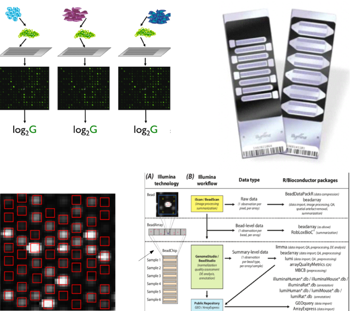
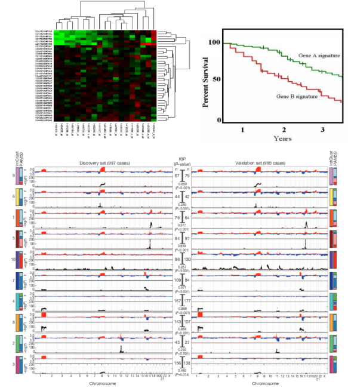
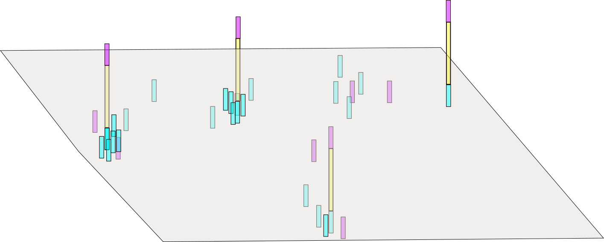
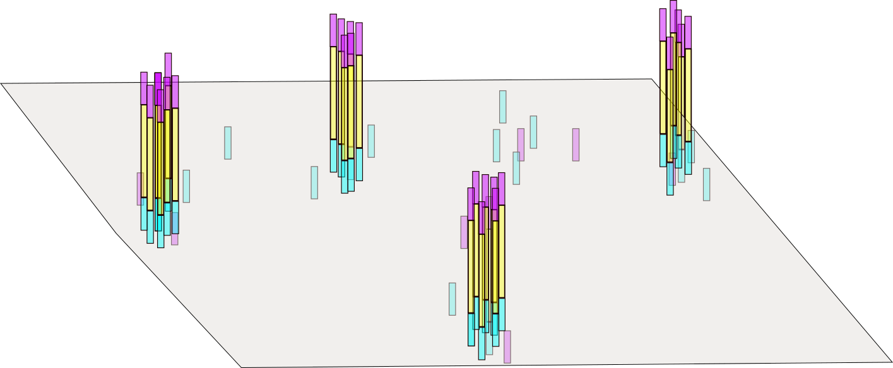
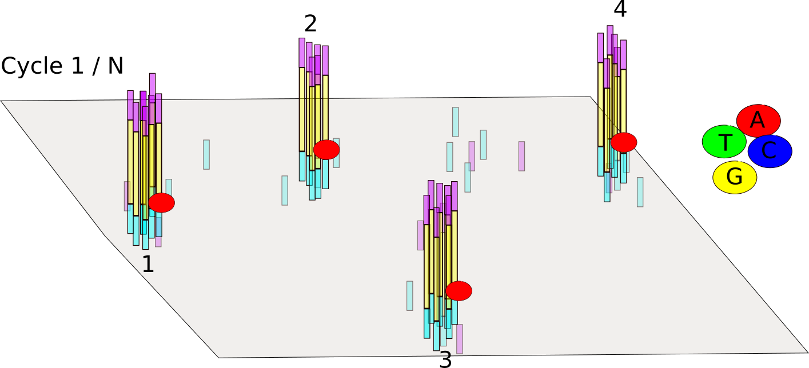
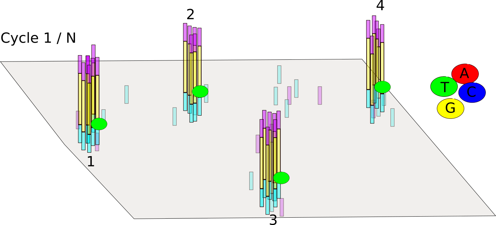
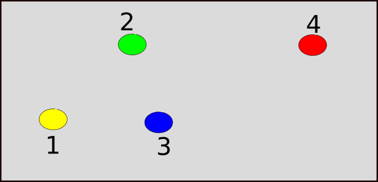
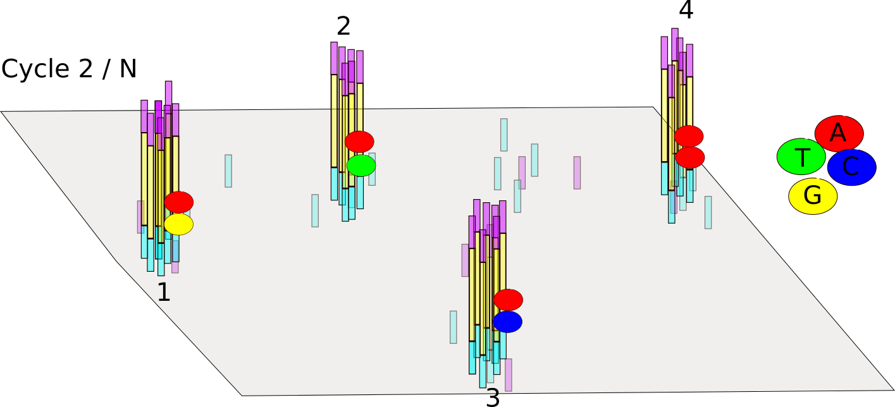
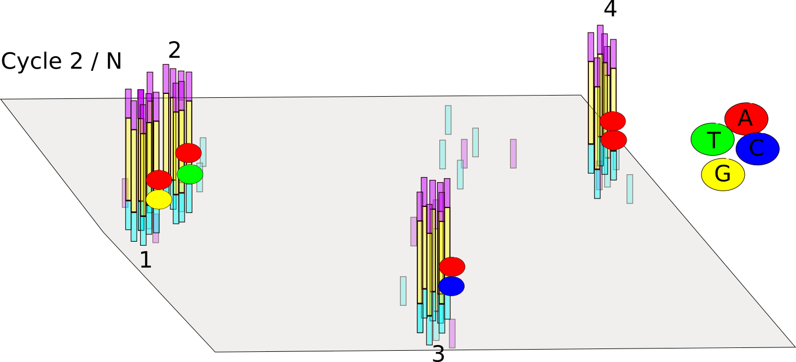
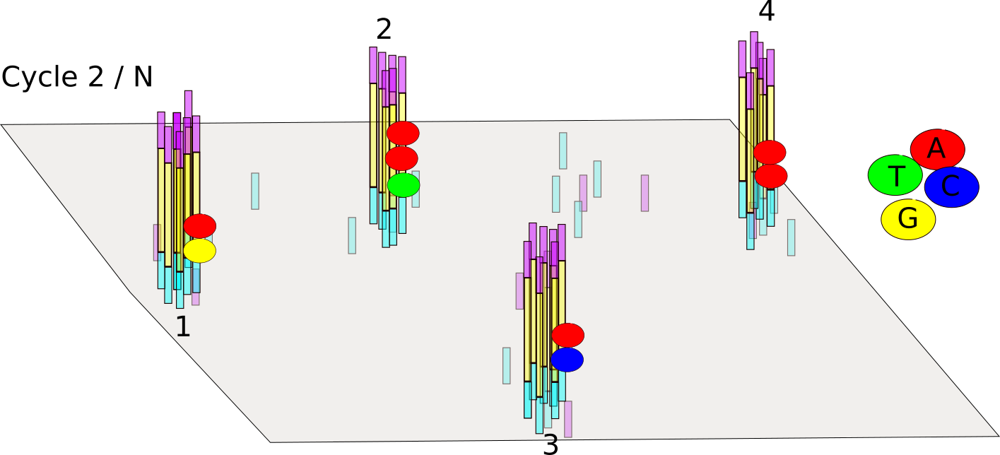

# Cast your minds back a few years..



## Plenty of success stories with microarrays




# Why do sequencing?


##Microarrays vs sequencing

- Probe design issues with microarrays
    + *'Dorian Gray effect'* http://www.biomedcentral.com/1471-2105/5/111
    + ' ...mappings are frozen, as a Dorian Gray-like syndrome: the apparent eternal youth of the mapping does not reflect that somewhere the 'picture of it' decays'
- Sequencing data are 'future proof'
    + if a new genome version comes along, just re-align the data!
    + can grab published-data from public repositories and re-align to **your** own choice of genome / transcripts and aligner
- Limited number of novel findings from microarrays
    + can't find what you're not looking for!
- Genome coverage
    + some areas of genome are problematic to design probes for
- Fusion genes, re-arrangements and complex events
    + not possible with microarray technology
- Maturity of analysis techniques
    + on the other hand, analysis methods and workflows for microarrays are well-established
    + until recently...

## What did we learn from arrays?

- Experimental Design; despite this fancy new technolgy, if we don't design the experiments properly we won't get meaningful conclusions
- Quality assessment; Yes, NGS experiments can still go wrong!
- Normalisation; NGS data come with their own set of biases and error that need to be accounted for
- Reproducibility: this is a good thing
- Plenty of tools and workflows were established.
- ***Don't forget about arrays; the data are all out there somewhere waiting to be discovered and explored***


## Illumina sequencing overview*

This video gives an overview of the  *'sequencing-by-synthesis'* approach used by Illumina. Other companies will have different techniques, but Illumina is probably the most-popular sequencing technology out there. For most of what we will discuss, it won't really matter how your samples were sequenced. 

<iframe width="420" height="315" src="https://www.youtube.com/embed/HMyCqWhwB8E" frameborder="0" allowfullscreen></iframe>


\* Other sequencing technologies are available

## Illumina sequencing

(as explained by a Bioinformatician who has never actually stepped into the lab....)

Images from:- http://www.illumina.com/content/dam/illumina-marketing/documents/products/illumina_sequencing_introduction.pdf

A *library* is prepared by breaking the DNA of interest into shorter, *single-strand fragments*. *Adapters* are each added to each end of the fragments. A *flow-cell* has already been prepared to have a *"lawn"* of sequences that are complementary to the adapters. 



*Bridge amplification* forms clusters of identical fragments on the flow-cell surface. This is required as we're going to be taking images of the flow-cell and need even copies of each fragment so that we get a decent signal. However, as we'll see later, this can introduce errors.



The construction of a sequencing reads involves adding a single, terminated, DNA base (each given a distinct flourescent label) one at a time, simulataneously across the whole flow-cell, and taking an image. 

So, we try adding an "A" with a red label and take an image



and then a "T" with a green, and take another image



Analysis of the images can determine which base was succesfully incorporated to each fragment. 



The process of added each base repeats for the next cycle, and so-on for *"N"* cycles. e.g. 100 times for a 100-base sequence.



Although this process is high-optimised and refined, the sheer number of reactions being performed means that errors are inevitable. The signal from a particular cluster could be affected by interference from its neighbours



Or sometimes we get a bit over-excited and add too many bases



Therefore the identification of bases comes with some degree of uncertainty which we must capture. 

## Paired-end

Most of the sequencing we come across in this course is likely to the *paired-end*, which means that we are sequencing both "ends" of the fragment. This will allow us to achieve better alignment to tricky regions of the genome and detect some kinds of variation that would not be possible with single-end reads alone. It also gives us greater confidence in the alignments and detecting artefacts caused by PCR amplification


## Multiplexing

We can also add multiple samples into the same sequencing library. The fragments from each sequence can be identified by a barcode (typically a few bases in length) unique to that sample. When the sequence reads are generated, they have the barcode at the beginning. The process of *demultiplexing* is used to identify to barcodes present for each read and split into separate files for alignment. 

Multiplexing is a way of increasing our sample size. 


## Image processing 

- Sequencing produces high-resolution `.TIFF` images; not unlike microarray data
- 100 tiles per lane, 8 lanes per flow cell, 100 cycles
- 4 images (A,G,C,T) per tile per cycle = 320,000 images
- Each `.TIFF` image ~ 7Mb = 2,240,000 Mb of data (**2.24TB**)


## Base-calling

- "*Bustard*"


- *"Uses cluster intensities and noise estimate to output the sequence of bases read from each cluster, along with a confidence level for each base."*
    + http://openwetware.org/wiki/BioMicroCenter:IlluminaDataPipeline
- **You will never have to do this**
    + In fact, the TIFF images are deleted by the instrument on-the-fly

## <a name=rawreads></a> Raw reads

- The most basic file type you will see is probably going to be *fastq*
    + Data in public-repositories (e.g. Short Read Archive, GEO) tend to be in this format
- This represents all sequences created after imaging process
    + No idea at this stage whether the sequences will align or not
- No standard file extension. *.fq*, *.fastq*, *.sequence.txt*
- Essentially they are text files
    + Can be manipulated with standard unix tools; e.g. *cat*, *head*, *grep*, *more*, *less*
- They can be compressed and appear as *.fq.gz*
- Same format regardless of sequencing protocol (i.e. RNA-seq, ChIP-seq, DNA-seq etc)
- Each sequence is described over 4 lines
- For paired-end data you get two files
    + they should have the same number of lines
    + the sequences should be in the same order


We don't need any special software to view these, but bear in mind there can be ~ 250 Million reads (sequences) per Hi-Seq lane.


### Fastq sequence names

The name of a sequence is unique and can encode some useful information. e.g.

```
@HWUSI-EAS100R:6:73:941:1973#0/1
```

- The name of the sequencer (HWUSI-EAS100R)
- The flow cell lane (6)
- Tile number with the lane (73)
- x co-ordinate within the tile (941)
- y co-ordinate within the tile (1973)
- \#0 index number for a multiplexed sample 
-  /1; the member of a pair, /1 or /2 (paired-end or mate-pair reads only)

However, this depends on instrument setup and processing pipelines. Sometimes the tile and coordinate information is omitted to save space. 

### Fastq quality scores

As we saw earlier the process of deciding which base is present at each cycle of each fragment comes with some probability (`p`) that we make a mistake. The quality score expresses our confidence in a particular base-call; higher quality score, higher confidence

- One such score for each base of sequencing. i.e. 100 scores for 100 bases of sequencing
- These are of importance if we want to call SNVs etc.
    + need to be sure that differences detected from the reference genome and legitimate, and not caused by sequencing error

The raw base-calling probabilities are converted to text characters to make it easier to store in a file

```
N?>:<9>>>:=;>>?<>:@?>;==@@@>?=AAA<>=A@?6>4B=<>>.@>?<@;?#############
```

First of all, we convert the base-calling probability (p) into a `Q` score using the formula

- Quality scores $$ Q = -10log_{10}p$$
    + Q = 30, p=0.001
    + Q = 20, p=0.01
    + Q = 10, p=0.1
- These numeric quanties are *encoded* as [**ASCII**](http://ascii-code.com/) code
    + ASCII codes 1 - 32 have historical uses such as start of text, carriage return, new line etc
    + At least 33 to get to meaningful characters


Annoyingly, different sequencing instruments have used different offsets over time. It's important to check what encoding has been used for your data

- Most modern sequencing will be `Phred+33`
- Tools should be able to detect what is in-use

This handy graphic from [wikipedia](https://en.wikipedia.org/wiki/FASTQ_format#Encoding) compares the different schemes

  

Given a particular quality string, we have to look-up the ASCII code for each character and subtract the offset to get the Q score. We can then convert to a probability using the formula:-

$$ p = 10^{-Q/10} $$

So for our particular example: 

```
N?>:<9>>>:=;>>?<>:@?>;==@@@>?=AAA<>=A@?6>4B=<>>.@>?<@;?#############
```

it works out as follows:-

```{r echo=FALSE,message=FALSE,warning=FALSE,comment=NA}
library(ShortRead)

pq <- PhredQuality("N?>:<9>>>:=;>>?<>:@?>;==@@@>?=AAA<>=A@?6>4B=<>>.@>?<@;?#############")
code <- as.integer(charToRaw(as.character(pq)))
qs <- code-33
probs <- 10^(unlist(qs)/-10)

df <- data.frame(Character = unlist(strsplit(as.character(pq),"")), Code = code, "Minus Offset (33) " = code -33,Probability = round(probs,5))
df[1:10,]
cat("...")
cat("...")
df[58:68,]
```

For the extremely-keen we can do this in `R`:-

```{r}
pq <- "N?>:<9>>>:=;>>?<>:@?>;==@@@>?=AAA<>=A@?6>4B=<>>.@>?<@;?#############"
code <- as.integer(charToRaw(as.character(pq)))
qs <- code -33
qs
probs <- 10^(unlist(qs)/-10)
round(probs,5)
```

Now it's time to get our hands on some `.fastq` data and start to explore it.