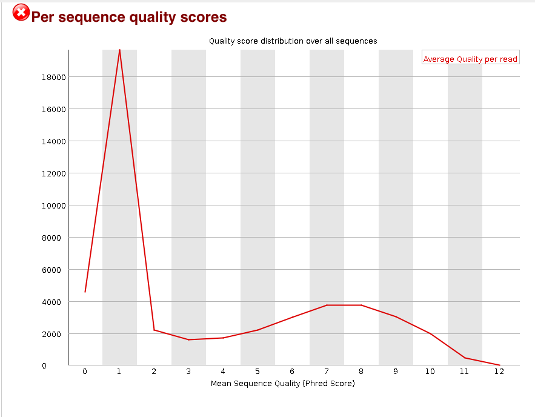

# Cast your minds back a few years..


## Plenty of success stories with microarrays


# Why do sequencing?


##Microarrays vs sequencing

- Probe design issues with microarrays
    + *'Dorian Gray effect'* http://www.biomedcentral.com/1471-2105/5/111
    + ' ...mappings are frozen, as a Dorian Gray-like syndrome: the apparent eternal youth of the mapping does not reflect that somewhere the 'picture of it' decays'
- Sequencing data are 'future proof'
    + if a new genome version comes along, just re-align the data!
    + can grab published-data from public repositories and re-align to **your** own choice of genome / transcripts and aligner
- Limited number of novel findings from microarrays
    + can't find what you're not looking for!
- Genome coverage
    + some areas of genome are problematic to design probes for
- Fusion genes, re-arrangements and complex events
    + not possible with microarray technology
- Maturity of analysis techniques
    + on the other hand, analysis methods and workflows for microarrays are well-established
    + until recently...

## What did we learn from arrays?

- Experimental Design; despite this fancy new technolgy, if we don't design the experiments properly we won't get meaningful conclusions
- Quality assessment; Yes, NGS experiments can still go wrong!
- Normalisation; NGS data come with their own set of biases and error that need to be accounted for
- Reproducibility: this is a good thing
- Plenty of tools and workflows were established.
- ***Don't forget about arrays; the data are all out there somewhere waiting to be discovered and explored***
    + e.g. [repositive.io](https://repositive.io/) platform for browse multiple repositories for data for a particular condition


## Illumina sequencing overview*

This video gives an overview of the  *'sequencing-by-synthesis'* approach used by Illumina. Other companies will have different techniques, but Illumina is probably the most-popular sequencing technology out there. For most of what we will discuss, it won't really matter how your samples were sequenced. 

<iframe width="420" height="315" src="https://www.youtube.com/embed/HMyCqWhwB8E" frameborder="0" allowfullscreen></iframe>


\* Other sequencing technologies are available

## Illumina sequencing


Images from:- http://www.illumina.com/content/dam/illumina-marketing/documents/products/illumina_sequencing_introduction.pdf

A *library* is prepared by breaking the DNA of interest into shorter, *single-strand fragments*. *Adapters* are each added to each end of the fragments. A *flow-cell* has already been prepared to have a *"lawn"* of sequences that are complementary to the adapters. 


*Bridge amplification* forms clusters of identical fragments on the flow-cell surface. This is required as we're going to be taking images of the flow-cell and need even copies of each fragment so that we get a decent signal. However, as we'll see later, this can introduce errors.


The construction of a sequencing reads involves adding a single, terminated, DNA base (each given a distinct flourescent label) one at a time, simulataneously across the whole flow-cell, and taking an image. 

So, we try adding an "A" with a red label and take an image


and then a "T" with a green, and take another image


Analysis of the images can determine which base was succesfully incorporated to each fragment. 


The process of added each base repeats for the next cycle, and so-on for *"N"* cycles. e.g. 100 times for a 100-base sequence.


Although this process is high-optimised and refined, the sheer number of reactions being performed means that errors are inevitable. The signal from a particular cluster could be affected by interference from its neighbours


Or sometimes we get a bit over-excited and add too many bases


Therefore the identification of bases comes with some degree of uncertainty which we must capture. This uncertainty can be incorporated into our analysis, as we will see later.

## Paired-end

Most of the sequencing we come across in this course is likely to the *paired-end*, which means that we are sequencing both "ends" of the fragment. This will allow us to achieve better alignment to tricky regions of the genome and detect some kinds of variation that would not be possible with single-end reads alone. It also gives us greater confidence in the alignments and detecting artefacts caused by PCR amplification.

The fragments are design to be a particular distance apart and relative orientation; a fact that is exploited in some variant detection methods


## Multiplexing

We can also add multiple samples into the same sequencing library. The fragments from each sequence can be identified by a barcode (typically a few bases in length) unique to that sample. When the sequence reads are generated, they have the barcode at the beginning. The process of *demultiplexing* is used to identify to barcodes present for each read and split into separate files for alignment. 

Multiplexing is a way of increasing our sample size. 


## Image processing 

- Sequencing produces high-resolution `.TIFF` images; not unlike microarray data
- 100 tiles per lane, 8 lanes per flow cell, 100 cycles
- 4 images (A,G,C,T) per tile per cycle = 320,000 images
- Each `.TIFF` image ~ 7Mb = 2,240,000 Mb of data (**2.24TB**)


## Base-calling

- "*Bustard*"


- *"Uses cluster intensities and noise estimate to output the sequence of bases read from each cluster, along with a confidence level for each base."*
    + http://openwetware.org/wiki/BioMicroCenter:IlluminaDataPipeline
- **You will never have to do this**
    + In fact, the TIFF images are deleted by the instrument on-the-fly

## <a name=rawreads></a> Raw reads

- The most basic file type you will see is probably going to be *fastq*
    + Data in public-repositories (e.g. Short Read Archive, GEO) tend to be in this format
- This represents all sequences created after imaging process
    + No idea at this stage whether the sequences will align or not
- No standard file extension. *.fq*, *.fastq*, *.sequence.txt*
- Essentially they are text files
    + Can be manipulated with standard unix tools; e.g. *cat*, *head*, *grep*, *more*, *less*
- They can be compressed and appear as *.fq.gz*
- Same format regardless of sequencing protocol (i.e. RNA-seq, ChIP-seq, DNA-seq etc)
- Each sequence is described over 4 lines
- For paired-end data you get two files
    + they should have the same number of lines
    + the sequences should be in the same order


We don't need any special software to view these, but bear in mind there can be ~ 250 Million reads (sequences) per Hi-Seq lane. So using Word or Notepad is probably not a great idea.


An example `.fastq` file has been provided for you in the folder `/home/participant/Course_Materials/Day1/`. If you are curious how this fastq file was generated, you can see the [Appendix](#appendix) for details.

We can launch the ***CRUK Docker*** from the Desktop and navigate to the directory containing the files using the `cd` command

- You don't need to type the full path. Start typing and use the Tab key to auto-complete

```{}
cd /home/participant/Course_Materials/Day1/
```

If we wanted to check the directory we are currently looking at, we can use the `pwd` command.

```{}
pwd 
```


The `ls` command will *list* all the files in this directory

```{}
ls
```

Then print the first few lines using the standard unix command `head`

- We set the argument `-n 12` to print the first 12 lines of the file `sample.fq1`

```{}
head -n 12 sample.fq1
```

```{r, echo=FALSE,comment=NA}
cat(system("head -n12 sample.fq1",intern=TRUE),sep="\n")
```

```{}
head -n 12 sample.fq2
```


```{r, echo=FALSE,comment=NA}
cat(system("head -n12 sample.fq2",intern=TRUE),sep="\n")
```

The unix command `wc` can count the number of lines in a file with the option `-l`

```{}
wc -l sample.fq1
```

```{r echo=FALSE,comment=NA}
cat(system("wc -l sample.fq1",intern=TRUE),sep="\n")
```

What would you type to print the first 12 lines of `sample.fq2`?

```{}


```


### Fastq sequence names

The name of a sequence is unique and can encode some useful information. e.g.

```
@HWUSI-EAS100R:6:73:941:1973#0/1
```

- The name of the sequencer (HWUSI-EAS100R)
- The flow cell lane (6)
- Tile number with the lane (73)
- x co-ordinate within the tile (941)
- y co-ordinate within the tile (1973)
- \#0 index number for a multiplexed sample 
-  /1; the member of a pair, /1 or /2 (paired-end or mate-pair reads only)

However, this depends on instrument setup and processing pipelines. Sometimes the tile and coordinate information is omitted to save space. 

### Fastq quality scores

As we saw earlier the process of deciding which base is present at each cycle of each fragment comes with some probability (`p`) that we make a mistake. The quality score expresses our confidence in a particular base-call; higher quality score, higher confidence

- One such score for each base of sequencing. i.e. 100 scores for 100 bases of sequencing
- These are of importance if we want to call SNVs etc.
    + need to be sure that differences detected from the reference genome and legitimate, and not caused by sequencing error

The raw base-calling probabilities are converted to text characters to make it easier to store in a file

```
N?>:<9>>>:=;>>?<>:@?>;==@@@>?=AAA<>=A@?6>4B=<>>.@>?<@;?#############
```

First of all, we convert the base-calling probability (p) into a `Q` score using the formula

- Quality scores $$ Q = -10log_{10}p$$
    + Q = 30, p=0.001
    + Q = 20, p=0.01
    + Q = 10, p=0.1
- These numeric quanties are *encoded* as [**ASCII**](http://ascii-code.com/) code
    + ASCII codes 1 - 32 have historical uses such as start of text, carriage return, new line etc
    + At least 33 to get to meaningful characters


Annoyingly, different sequencing instruments have used different offsets over time. It's important to check what encoding has been used for your data

- Most modern sequencing will be `Phred+33`
- Tools should be able to detect what is in-use

This handy graphic from [wikipedia](https://en.wikipedia.org/wiki/FASTQ_format#Encoding) compares the different schemes

  

Given a particular quality string, we have to look-up the ASCII code for each character and subtract the offset to get the Q score. We can then convert to a probability using the formula:-

$$ p = 10^{-Q/10} $$

So for our particular example: 

```
N?>:<9>>>:=;>>?<>:@?>;==@@@>?=AAA<>=A@?6>4B=<>>.@>?<@;?#############
```

it works out as follows:-

```{r echo=FALSE,message=FALSE,warning=FALSE,comment=NA}
library(ShortRead)

pq <- PhredQuality("N?>:<9>>>:=;>>?<>:@?>;==@@@>?=AAA<>=A@?6>4B=<>>.@>?<@;?#############")
code <- as.integer(charToRaw(as.character(pq)))
qs <- code-33
probs <- 10^(unlist(qs)/-10)

df <- data.frame(Character = unlist(strsplit(as.character(pq),"")), Code = code, "Minus Offset (33) " = code -33,Probability = round(probs,5))
df[1:10,]
cat("...")
cat("...")
df[58:68,]
```

For the extremely-keen we can do this in `R`:-

```{r}
pq <- "N?>:<9>>>:=;>>?<>:@?>;==@@@>?=AAA<>=A@?6>4B=<>>.@>?<@;?#############"
code <- as.integer(charToRaw(as.character(pq)))
qs <- code -33
qs
probs <- 10^(unlist(qs)/-10)
round(probs,5)
```

It is possible to interrogate the `fastq` files in R. However, in practice we tend to use other tools such as fastqc described in the next section.

```{r eval=FALSE}
library(ShortRead)
fq <- readFastq("sample.fq1")
fq
```


# <a name="fastqc"></a> Fastqc Primer
*(Acknowledgement to Ines De Santiago for her session at the [previous summer school](http://bioinformatics-core-shared-training.github.io/cruk-bioinf-sschool/Day1/NGS_QC_inesdesantiago.pdf))*

[FastQC](http://www.bioinformatics.babraham.ac.uk/projects/fastqc/) from the Babraham Institute Bioinformatics Core has emerged as the standard tool for performing quality assessment on sequencing reads 

The manual for `fastqc` is available [online](http://www.bioinformatics.babraham.ac.uk/projects/fastqc/Help/) and is very comprehensive; especially the parts which describe particular [sections](http://www.bioinformatics.babraham.ac.uk/projects/fastqc/Help/3%20Analysis%20Modules/) of the report. The authors also run a ["QCfail"](https://sequencing.qcfail.com/) blog which discusses some sequencing QC errors they have encountered and how they were diagnosed.

A *"traffic light"* system is used to draw your attention to sections of the report that require further investigation. However, it is worth bearing in mind that `fastqc` is designed to be run on fastq files from any type of sequencing experiment and has no knowledge of the particular library preparation, or conditions that you are studying. It could be that you *expect* high levels of duplication or GC content. Always consider the nature of your study before taking any drastic action!

Also, `fastqc` will not actually *do* anything to your data. If you decide to trim or remove contamination for your samples, you will need to use another tool.

## The sections of a `fastqc` report

1) [Basic Statistics](http://www.bioinformatics.babraham.ac.uk/projects/fastqc/Help/3%20Analysis%20Modules/1%20Basic%20Statistics.html)


Some simple statistics about the composition of your file, which can be useful to see if it has guessed the encoding correctly and identified the correct number of reads. This section of the report is designed ***never*** to give a warning message

2) [Per-base sequence quality](http://www.bioinformatics.babraham.ac.uk/projects/fastqc/Help/3%20Analysis%20Modules/2%20Per%20Base%20Sequence%20Quality.html)


This section of the report is probably the one that receives most attention. It's generally accepted that there is a degradation of quality over the duration of a sequencing run, but the extent to which the quality "drops-off" should be monitored. A boxplot is produced for every base-position in the read and the central line and yellow box represent the median and inter-quartile range in the usual manner.

Ideally, the plot should look *something* like following:-


However, a ***warning*** will be triggered if the lower quartile (25% of the data) of any base in less than 10, or if the median for any base is less than 25. A ***failure*** (red cross in the traffic light system) occurs if the lower quartile for any base is less than 5, or if the median for any base is less than 20.

3) [Per-sequence quality scores](http://www.bioinformatics.babraham.ac.uk/projects/fastqc/Help/3%20Analysis%20Modules/3%20Per%20Sequence%20Quality%20Scores.html)

With this section of the report, we are checking to see if there is a population of sequences that have low quality values. A ***warning*** occurs when the mean quality is below 27, whereas a ***failure*** indicates a mean below 20.




# Running `fastqc`

`fastqc` can be run from the ***CRUK Docker*** as follows;

```{}
cd /home/participant/Course_Materials/Day1/
fastqc sample.fq1
```

As a result, you should get two files in your working directory; `sample.fq1_fastqc.zip` and `sample.fq1_fastqc.html`. The `.zip` file contains all the metrics that `fastqc` computes, should you wish to perform extra manipulation and visualisation beyond what `fastqc` offers. 

The `html` file can be opened in a web browser. If you follow the link on the Desktop to `Course_Materials` you should be able to navigate to the folder `Day1/` and see the files we have created.


# <a name="appendix"></a> Appendix 

For your reference, here is how the example files were created

First, we download an example bam file from the 1000 genomes project

```{}
wget ftp://ftp.1000genomes.ebi.ac.uk/vol1/ftp/technical/other_exome_alignments/NA06984/exome_alignment/NA06984.mapped.illumina.mosaik.CEU.exome.20111114.bam
```

Then the file is *downsampled* to give a much reduced set of reads. The original file can be removed
```{}
java -jar $PICARD DownsampleSam I=NA06984.mapped.illumina.mosaik.CEU.exome.20111114.bam O=random.bam P=0.1 VALIDATION_STRINGENCY=SILENT

rm NA06984.mapped.illumina.mosaik.CEU.exome.20111114.bam
```

For convenience, we filter the file to keep only reads that are properly paired. Then picard is used again to extract the fastq data from the file. As the original alignments were a mix of 68 and 76 bases, we trim all the reads to 68 bases to processing easier.

```{}
samtools view -f 0x02 -b random.bam > paired.bam 

java -jar $PICARD SamToFastq I=paired.bam F=sample.fq1 VALIDATION_STRINGENCY=SILENT F2=sample.fq2 R1_MAX_BASES=68 R2_MAX_BASES=68
```

# (OPTIONAL / Advanced)

*If you are interested this section covers how to trim our data*

Based on these plots we may want to *trim* our data; *fastqc will not do this for us*.  

Popular choices are [fastx_toolit](http://hannonlab.cshl.edu/fastx_toolkit/), [trimmomatic](http://www.usadellab.org/cms/index.php?page=trimmomatic) and  [cutadapt](http://cutadapt.readthedocs.io/en/stable/index.html); all of which should be installed on your computers. As implied by the name, `cutadapt` is useful for removing adaptor sequences. 

`fastx_toolkit` allows us to remove reads that do not have a high enough proportion of high-quality reads.

You can run these commands after having run the ***CRUK Docker*** shortcut

```{}
## Check we're in the correct directory
cd /home/participant/Course_Materials/Day1/
fastq_quality_filter -v Q 33 -q 20 -p 75 -i sample.fq1 -o sample_filtered.fq
```

the options were used:-

```{}
-i: input file
-o: output file
-v: report the number of sequences
-Q:  33, determines the input quality ASCII offset
-q: 20, the quality value required
-p 75: the percentage of bases required to have that quality value
```

the output should be something like...

```{}
Quality cut-off: 20
Minimum percentage: 75
Input: 6290535 reads.
Output: 5399767 reads.
discarded 890768 (14%) low-quality reads.
```

It can also do straightforward trimming to a particular read length

```{}
fastx_trimmer -v -f 1 -l 60 -i sample.fq1 -o sample.fastx.trimmed.fq1
```

the options specified were:-

```{}
-f: first base to keep
-l: last base to keep
-i: input file
-o: output file
-v: report number of sequences
```


Trimmomatic is interesting as it allows for differently-sized reads. 

To use `trimmomatic` we can run the following in a Terminal. Here `$TRIMMOMATIC` is used to refer to the particular location that the tool has been installed to.

```{}

java -jar $TRIMMOMATIC SE -phred33 sample.fq1 sample.trimmed.fq1 TRAILING:3 MINLEN:30
```

```{}
SE: run single-end mode
-phred33: use the offset of 33 to interpret quality scores
TRAILING:3 cut bases from the end of the read if below 3
```

We can interrogate the files we have just created using the `ShortRead` package.

```{r echo=FALSE,message=FALSE,warning=FALSE,eval=FALSE}
## These commands need to be run in RStudio

library(ShortRead)
fq <- readFastq("sample.fq1")
fq
trimmed.fq <- readFastq("sample.trimmed.fq1")
trimmed.fq

```

How many were removed?

```{r ,eval=FALSE}
length(trimmed.fq)/length(fq)
```

```{r,eval=FALSE}
summary(width(sread(trimmed.fq)))
hist(width(sread(trimmed.fq)))
```


We can verify why some of the reads were removed

```{r,eval=FALSE}
old.ids <- as.character(id(fq))
ids.left <- as.character(id(trimmed.fq))

missing.ids <- setdiff(old.ids,ids.left)
myquals <- quality(fq)
myquals[old.ids %in% missing.ids]
```

******

### Exercise

- Re-run `fastqc` and observe what effect this has on the results

```{eval=FALSE}
fastqc sample.trimmed.fq1
fastqc sample.fastx.trimmed.fq1
fastqc sample.filtered.fq1
```


******
