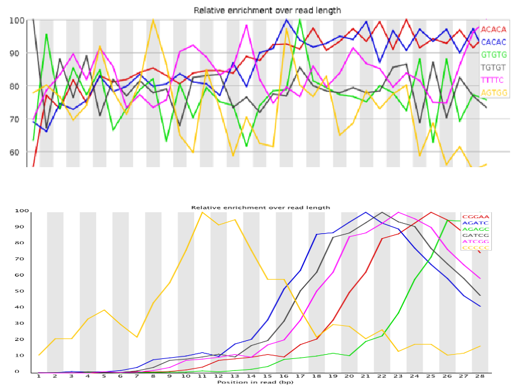

# <a name="fastqc"></a> Fastqc Primer and trimming reads
*(Acknowledgement to Ines De Santiago for her session at the [previous summer school](http://bioinformatics-core-shared-training.github.io/cruk-bioinf-sschool/Day1/NGS_QC_inesdesantiago.pdf))*

[FastQC](http://www.bioinformatics.babraham.ac.uk/projects/fastqc/) from Babraham Bioinformatics Core has emerged as the standard tool for performing quality assessment on sequencing reads 

It can be run from the ***Terminal*** as follows;

```{}
fastqc sample.fq1
```

As a result, you should get two files in your working directory; `sample.fq1_fastqc.zip` and `sample.fq1_fastqc.html`. The `.zip` file contains all the metrics that `fastqc` computes, should you wish to perform extra manipulation and visualisation beyond what `fastqc` offers. The `html` file can be opened in a web browser. The easier way to see the output is to navigate to the current directory using a file explorer, and double-click on the file.

The manual for `fastqc` is available [online](http://www.bioinformatics.babraham.ac.uk/projects/fastqc/Help/) and is very comprehensive; especially the parts which describe particular [sections](http://www.bioinformatics.babraham.ac.uk/projects/fastqc/Help/3%20Analysis%20Modules/) of the report. The authors also run a ["QCfail"](https://sequencing.qcfail.com/) blog which discusses some sequencing QC errors they have encountered and how they were diagnosed.

A *"traffic light"* system is used to draw your attention to sections of the report that require further investigation. However, it is worth bearing in mind that `fastqc` is designed to be run on fastq files from any type of sequencing experiment and has no knowledge of the particular library preparation, or conditions that you are studying. It could be that you *expect* high levels of duplication or GC content. Always consider the nature of your study before taking any drastic action!

## The sections of a `fastqc` report

1) [Basic Statistics](http://www.bioinformatics.babraham.ac.uk/projects/fastqc/Help/3%20Analysis%20Modules/1%20Basic%20Statistics.html)


Some simple statistics about the composition of your file, which can be useful to see if it has guessed the encoding correctly and identified the correct number of reads. This section of the report is designed ***never*** to give a warning message

2) [Per-base sequence quality](http://www.bioinformatics.babraham.ac.uk/projects/fastqc/Help/3%20Analysis%20Modules/2%20Per%20Base%20Sequence%20Quality.html)


This section of the report is probably the one that receives most attention. It's generally accepted that there is a degradation of quality over the duration of a sequencing run, but the extent to which the quality "drops-off" should be monitored. A boxplot is produced for every base-position in the read and the central line and yellow box represent the median and inter-quartile range in the usual manner.

Ideally, the plot should look *something* like following:-


However, a ***warning*** will be triggered if the lower quartile (25% of the data) of any base in less than 10, or if the median for any base is less than 25. A ***failure*** (red cross in the traffic light system) occurs if the lower quartile for any base is less than 5, or if the median for any base is less than 20.

3) [Per-sequence quality scores](http://www.bioinformatics.babraham.ac.uk/projects/fastqc/Help/3%20Analysis%20Modules/3%20Per%20Sequence%20Quality%20Scores.html)

With this section of the report, we are checking to see if there is a population of sequences that have low quality values. A ***warning*** occurs when the mean quality is below 27, whereas a ***failure*** indicates a mean below 20.


4) [Per-base sequence content](http://www.bioinformatics.babraham.ac.uk/projects/fastqc/Help/3%20Analysis%20Modules/4%20Per%20Base%20Sequence%20Content.html)

This is one area of the report where you need to exercise some caution, because the results may depend on the type of sequencing you are performing. This course is going to be focussed on whole-genome (or exome) DNA sequencing, which should result in an even distribution of bases along the read length.


Sometimes you will get biased sequencing composition at the start of reads due to adaptor contamination, which would tend to be flagged elsewhere in the report


And some biases are inevitable due to the type of sequencing being performed. e.g. RNA-seq is know to introduce biases at the start of reads due to ["random" hexamer priming](http://www.ncbi.nlm.nih.gov/pmc/articles/PMC2896536/)


Or in the cases of a RRBS library, you will have converted most of the C bases to T, so would expect something along the following lines:-


5) [Per-sequence GC content](http://www.bioinformatics.babraham.ac.uk/projects/fastqc/Help/3%20Analysis%20Modules/5%20Per%20Sequence%20GC%20Content.html)

A familiar bell-shaped normal distribution should be seen. However, the location of the mean (central peak) will depend on the species being sequenced. `fastqc` has no way of knowing what species to expect, so may produce a warning or error message for an otherwise good-quality sequencing run.


Significant deviations from normal would tend to signify a problem with the library though, or contamination from different species


6) [Per-base N content](http://www.bioinformatics.babraham.ac.uk/projects/fastqc/Help/3%20Analysis%20Modules/6%20Per%20Base%20N%20Content.html)

Recall that an `N` base is recorded when we are not confident enough to make a particular base call. We might sometimes see some `N `appearing at the end of a sequence due to the expected drop in quality, although this should be a low proportion.


7) [Sequence length distribution](http://www.bioinformatics.babraham.ac.uk/projects/fastqc/Help/3%20Analysis%20Modules/7%20Sequence%20Length%20Distribution.html)

As you might expect, this will tell you if all your reads are not the same length. There might be entirely plausible reasons for having reads of different length (e.g. reads generated from multiple runs), so again we may wish to ignore any warnings that arise from this part of the report.


8) [Duplicate Sequences](http://www.bioinformatics.babraham.ac.uk/projects/fastqc/Help/3%20Analysis%20Modules/8%20Duplicate%20Sequences.html)

Again, we need to exercise caution when interpreting these plots and traffic lights as they as based on a library that is diverse and not enriched for any particular property. 


A perfectly good and respectable RNA-seq library may have duplication rates above 50%


9) [Overrepresented Sequences](http://www.bioinformatics.babraham.ac.uk/projects/fastqc/Help/3%20Analysis%20Modules/9%20Overrepresented%20Sequences.html)

This section of the report can highlight contamination or lower-than-expected diversity


The tool will attempt to identify and adaptors present in the data from common ones that it knows about


10) [Kmer Content](http://www.bioinformatics.babraham.ac.uk/projects/fastqc/Help/3%20Analysis%20Modules/11%20Kmer%20Content.html)

Although the overrepresented sequences section above will identify sequences that are *exactly* duplicated, it may miss other problems in the data such as i) long sequences with poor quality ii) repeated sequences appearing at various places

This section reports the positional bias of the 6 most-biased k-mers, and whereabouts they occur in the read



*"Random"* hexamer primer in RNA-seq libraries are sometimes not as random as we would hope


Described in detail in [Hansen et al. (2010)](http://www.ncbi.nlm.nih.gov/pmc/articles/PMC2896536/)

******

### Exercise

- View the `fastqc` report for our example `.fq` file
    + see the start of this section for how to run the tool
- Are there any areas of concern?

******


Based on these plots we may want to *trim* our data; *fastqc will not do this for us*.  

Popular choices are [fastx_toolit](http://hannonlab.cshl.edu/fastx_toolkit/), [trimmomatic](http://www.usadellab.org/cms/index.php?page=trimmomatic) and  [cutadapt](http://cutadapt.readthedocs.io/en/stable/index.html); all of which should be installed on your computers. As implied by the name, `cutadapt` is useful for removing adaptor sequences. 

`fastx_toolkit` allows us to remove reads that do not have a high enough proportion of high-quality reads.

```{}
fastq_quality_filter -v Q 33 -q 20 -p 75 -i Day1/sample.fq1 -o Day1/sample_filtered.fq
```

the options were used:-

```{}
-i: input file
-o: output file
-v: report the number of sequences
-Q:  33, determines the input quality ASCII offset
-q: 20, the quality value required
-p 75: the percentage of bases required to have that quality value
```

the output should be something like...

```{}
Quality cut-off: 20
Minimum percentage: 75
Input: 6290535 reads.
Output: 5399767 reads.
discarded 890768 (14%) low-quality reads.
```

It can also do straightforward trimming to a particular read length

```{}
fastx_trimmer -v -f 1 -l 60 -i Day1/sample.fq1 -o Day1/sample.fastx.trimmed.fq1
```

the options specified were:-

```{}
-f: first base to keep
-l: last base to keep
-i: input file
-o: output file
-v: report number of sequences
```


Trimmomatic is interesting as it allows for differently-sized reads. 

To use `trimmomatic` we can run the following in a Terminal. Here `$TRIMMOMATIC` is used to refer to the particular location that the tool has been installed to.

```{}
java -jar $TRIMMOMATIC SE -phred33 Day1/sample.fq1 Day1/sample.trimmed.fq1 TRAILING:3 MINLEN:30
```

```{}
SE: run single-end mode
-phred33: use the offset of 33 to interpret quality scores
TRAILING:3 cut bases from the end of the read if below 3
```

```{r echo=FALSE,message=FALSE,warning=FALSE}
library(ShortRead)
fq <- readFastq("sample.fq1")
```


For this output file it is instructive to load using `ShortRead`

```{r cache=TRUE}
trimmed.fq <- readFastq("sample.trimmed.fq1")
trimmed.fq
```


How many were removed?

```{r}
length(trimmed.fq)/length(fq)
```

```{r}
summary(width(sread(trimmed.fq)))
hist(width(sread(trimmed.fq)))
```


We can verify why some of the reads were removed

```{r}
old.ids <- as.character(id(fq))
ids.left <- as.character(id(trimmed.fq))

missing.ids <- setdiff(old.ids,ids.left)
myquals <- quality(fq)
myquals[old.ids %in% missing.ids]
```

******

### Exercise

- Re-run `fastqc` and observe what effect this has on the results

```{}
fastqc sample.trimmed.fq1
fastqc sample.fastx.trimmed.fq1
fastqc sample.filtered.fq1
```


******


# <a name="alignment"></a> Alignment

- Locating where each generated sequence came from in the genome
- Outside the scope of this course
- *Usually* perfomed automatically by a sequencing service
- For most of what follows in the course, we will assume alignment has been performed and we are dealing with aligned data
    + Popular aligners
    + bwa http://bio-bwa.sourceforge.net/
    + bowtie http://bowtie-bio.sourceforge.net/index.shtml
    + novoalign http://www.novocraft.com/products/novoalign/
    + stampy http://www.well.ox.ac.uk/project-stampy
    + many, many more.....
    
    
For completeness, we will show the commands used to aligned these two example fastq files.

We have previously downloaded a reference genome from the 1000 genomes into a directory `raw_data`
    
```{}
wget ftp://ftp.1000genomes.ebi.ac.uk/vol1/ftp/technical/reference/human_g1k_v37.fasta.gz -P ref_data/
gunzip ref_data/human_g1k_v37.fasta.gz
```

`bwa` can *index* the unzipped `.fasta` file. The option `-p` allows us how we want to prefix all the files that the indexing procedure creates. ***[N.B this step will take a long time]***

```{}
bwa index -p hg19 -a bwtsw ref_data/human_g1k_v37.fasta
```

Here's one we made earlier!

```{}
ls -l ref_data/
```

The command to perform the alignment is `bwa aln` which has many options. We are going to stick with the default.
```{}
bwa aln
```

Each `.fastq` file needs to be aligned separately. The output from this step is in a binary format that we cannot interpret directly.

```{}
bwa aln ref_data/hg19 Day1/sample.fq1 > sample_1.sai

bwa aln ref_data/hg19 Day1/sample.fq2 > sample_2.sai

```

We need to make use of the `bwa sampe` command to create a human-readable format. We give it the files from the previous step and the fastq files.

```{}
bwa sampe ../ref_data/human_g1k_v37.fasta sample_1.sai sample_2.sai sample.fq1 sample.fq2 > sample.sam 
```


The output is a `.sam` file that will be described in the next section

# <a name="appendix"></a> Appendix 

For your reference, here is how the example files were created

First, we download an example bam file from the 1000 genomes project

```{}
wget ftp://ftp.1000genomes.ebi.ac.uk/vol1/ftp/technical/other_exome_alignments/NA06984/exome_alignment/NA06984.mapped.illumina.mosaik.CEU.exome.20111114.bam
```

Then the file is *downsampled* to give a much reduced set of reads. The original file can be removed
```{}
java -jar $PICARD DownsampleSam I=NA06984.mapped.illumina.mosaik.CEU.exome.20111114.bam O=random.bam P=0.1 VALIDATION_STRINGENCY=SILENT

rm NA06984.mapped.illumina.mosaik.CEU.exome.20111114.bam
```

For convenience, we filter the file to keep only reads that are properly paired. Then picard is used again to extract the fastq data from the file. As the original alignments were a mix of 68 and 76 bases, we trim all the reads to 68 bases to processing easier.

```{}
samtools view -f 0x02 -b random.bam > paired.bam 

java -jar $PICARD SamToFastq I=paired.bam F=sample.fq1 VALIDATION_STRINGENCY=SILENT F2=sample.fq2 R1_MAX_BASES=68 R2_MAX_BASES=68
```

